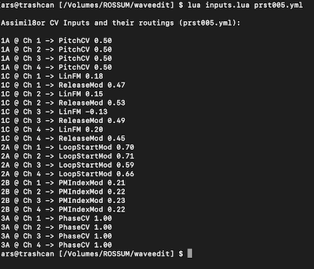

# a8inputs

This is a simple LUA script that shows CV inputs routing of a specified preset file in a conveniently sorted way.
Can be useful when revisiting presets from previous patches when no one remembers which CV inputs were involved.

I think it would be cool if Rossum Electro Music implemented this functionality in the module, perhaps under UTILITY button menu…

#### Usage

`lua inputs.lua <assimil8or preset file>`

